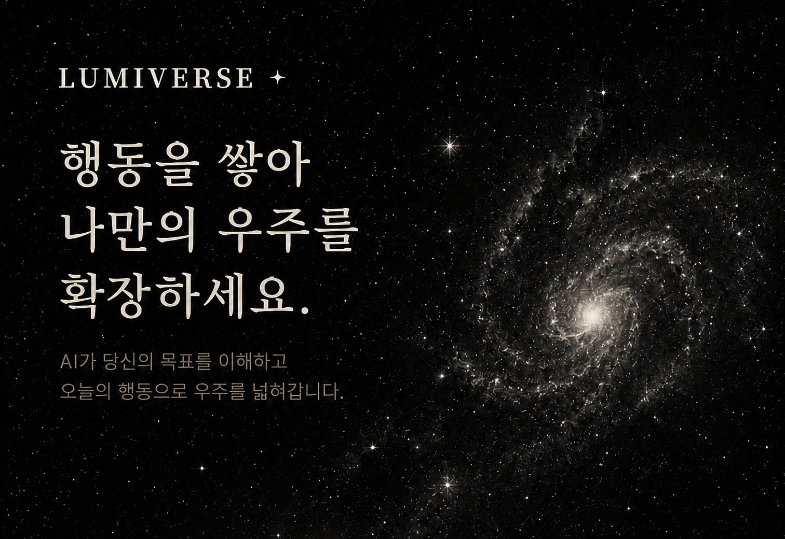

<!-- 긴 소개 이미지 (og_image) — 최상단 -->
<p align="center">
  
</p>

<h1 align="center">Lumiverse</h1>

<p align="center">작은 행동들의 여정을 따라 점점 더 또렷해지는 나만의 우주</p>

<p align="center">
  <a href="https://inorrni.github.io/lumiverse/"></a>
  <a href="https://github.com/inorrni/lumiverse/stargazers"></a>
  
  
</p>

<!-- 시연 GIF — 첫 5초에 매력 결정 (10초 이내 · 1280×720 · 5MB 이하) -->
<!-- TODO: docs/demo.gif 추가 후 아래 주석 해제 -->
<!--
<p align="center">
  
</p>
-->

> **[🚀 라이브 데모](https://inorrni.github.io/lumiverse/)**

## 🌟 소개

막연해서 못 시작하고, 보상이 멀어 못 버티는 사람을 위한 **나만의 우주를 확장하는 목표관리 서비스**입니다.
AI가 목표를 작은 단계로 쪼개고(실행), 매일의 행동을 별로 보상하며(지속), 진행할수록 나만의 우주가 점점 선명하게 확장됩니다.

### 컨셉 — SNR 우주

천문 관측의 **SNR(신호 대 잡음비)**: 희미한 천체도 관측을 누적하면 잡음을 뚫고 또렷해진다.
매일의 투두 체크(=관측)가 쌓이면 별 → 행성 → 은하계가 점점 선명해진다.

| 천체 | 매핑 | 선명화 규칙 | 보상 |
|---|---|---|---|
| **별** | 매일의 투두 | 체크 즉시 on/off (디데이 일수만큼 생성) | 체크하는 순간 별이 켜짐 — 즉각적 시각 보상 |
| **행성** | 세부목표 (3~5개) | 달성률(SNR)에 따라 100%를 5단계로 선명화 | 단계가 오를수록 행성이 또렷해짐 |
| **은하계** | 목표 | 소속 행성 선명도의 **평균** (우주 탭 % 값) | 목표가 완성될수록 나만의 우주가 선명하게 확장 |
| **별자리** | 은하계당 1개 | 누적 별 14개↑ 모이면 생성 가능 | 별자리(엠블럼) 생성 — 달성 기념 보상 |
| **블랙홀** | 폐기·재도전 보관함 | 삭제 아닌 보존·복원 | 재도전 시 복원 — 실패해도 잃지 않는 안전망 |

## ✨ 핵심 기능

- 🤖 **AI 목표 분해** — 목표 + 디데이 → 세부목표(행성) 3~5개 + 매일의 투두(별)
- ✅ **데일리 투두 체크** — 별 선명화로 즉각 보상
- 🌌 **우주 확장 시각화** — 별 → 행성 → 은하계, 별자리, 블랙홀
- 🧭 **AI 중간점검** — 누적 이력 기반 `강도↑(go) / 보완 / 종료(finish)` 판단
- 🕳 **블랙홀** — 포기한 목표를 비-처벌적으로 보관, 재도전 시 복원

## 🛠 기술 스택

| 영역 | 기술 |
|---|---|
| **Frontend** | Vite 5 + React 18 + React Router 7 |
| **3D 렌더** | Three.js + @react-three/fiber · drei (천체 시각화) |
| **DB / Auth** | Supabase (PostgreSQL + Auth, JWT) |
| **LLM** | Solar Pro (Upstage) |
| **서버리스** | Supabase Edge Functions (LLM 키 서버 보관) |
| **배포** | GitHub Pages (`inorrni.github.io/lumiverse`) |

## 🚀 빠른 시작

```bash
# 1) 클론
git clone https://github.com/inorrni/lumiverse.git
cd lumiverse

# 2) 의존성 설치
npm install

# 3) 환경변수 설정
cp .env.example .env.local
# .env.local 에 Supabase URL / anon key 입력

# 4) 실행
npm run dev
# → http://localhost:5173
```

> ⚠️ LLM API 키·service_role 키 같은 비밀값은 클라이언트에 두지 않고
> **Supabase Edge Function secrets** 로만 보관합니다. (`VITE_` 접두 금지)

## 📂 폴더 구조

```
src/
├── components/    # UI 컴포넌트 (layout 등)
├── pages/         # 라우트 페이지 (Landing, Today, Universe, BlackHole …)
├── hooks/         # custom hooks
├── store/         # 전역 상태 (Auth, Goal)
├── lib/           # Supabase·날짜 등 유틸
├── styles/        # 전역 스타일
└── sample/        # 샘플 데이터
```

## 🤝 협업 가이드

- 📋 **[협업 가이드 (CONTRIBUTING.md)](CONTRIBUTING.md)** — 브랜치·커밋·PR 규칙부터 읽으세요.
- 🛠 [환경설정 A to Z](docs/github/0_환경설정.md) — 내 컴퓨터 세팅 (한 번만)
- 🌿 [Claude Code로 git 하기](docs/github/1_깃_협업_클로드코드.md) — 매일의 작업 흐름
- 🔒 [보안 체크리스트](docs/github/2_보안_체크리스트.md) — 키·.env 다루기
- 🆘 [오류방지 FAQ](docs/github/3_오류방지_FAQ.md) — 막혔을 때

## 📄 라이선스

[MIT](LICENSE) © 2026 Lumiverse Team

---

🏆 **AI Reboot 경진대회 2026 출품작**
